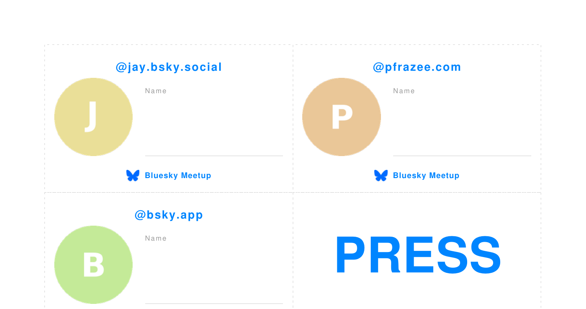

# Bluesky Name Card Generator

Generates printable name cards for Bluesky meetup events.

Each card shows the participant's Bluesky avatar (circular), their handle, a QR code linking to their profile, a name-writing field, and the event footer with the Bluesky butterfly logo.

Most of the following defaults can be overridden:

**Card size:** 89 × 53 mm (Japanese  business card landscape)  
**Sheet layout:** A4 portrait, 2 columns × 5 rows = 10 cards per page  
**Extra cards:** PRESS cards and blank cards are automatically appended



**Sample PDFs:**
[A4 meishi (89×53 mm)](samples/sample.pdf) · [Letter 4×3 inch](samples/sample-letter-4x3.pdf) · [Single card](samples/sample-single.pdf)

---

## Requirements

Python 3.9+

```bash
pip install -r requirements.txt
```


| Package     | Purpose                                         |
| ----------- | ----------------------------------------------- |
| `requests`  | Fetch avatar images from the Bluesky public API |
| `Pillow`    | Circular crop and image compositing             |
| `reportlab` | PDF generation                                  |
| `qrcode`   | QR code generation for profile links             |


### Optional: Inter font

The script uses **Inter** for Latin text if installed, and falls back to Helvetica.  
Download from [rsms.me/inter](https://rsms.me/inter/) and install system-wide.

---

## Usage

### From a handles list file

First, include a list of participants’ Bluesky usernames in `handles.txt`.

```bash
python3 bluesky_name_cards.py --file handles.txt --output cards.pdf
```

### One-off / single card

```bash
python3 bluesky_name_cards.py bsky.app --press 0 --blank 0 --output single.pdf
```

### Multiple handles inline

```bash
python3 bluesky_name_cards.py example.bsky.social bsky.app --output cards.pdf
```

### 4×3 inch cards on Letter paper

```bash
python3 bluesky_name_cards.py --file handles.txt \
  --card 4x3 --paper letter \
  --output cards-letter.pdf
```

---

## `handles.txt` format

One handle per line. Lines starting with `#` are treated as comments.  
Handles can include or omit the leading `@`.

```
# Bluesky Meetup in Tokyo Vol. 4
bsky.app
jp.bsky.app
status.bsky.app
atproto.com
safety.bsky.app
```

---

## Card layout

```
┌─────────────────────────────────────────────────────┐
│            @handle.bsky.social              ┌────┐  │  ← HANDLE_H zone (11 mm)
├─────────────────────────────────────────────│ QR │──│
│  ╭──────╮   Name                            └────┘  │  ← MIDDLE zone (30 mm)
│  │avatar│   ─────────────────────────────────────   │
│  ╰──────╯                                           │
├─────────────────────────────────────────────────────│
│  🦋 Bluesky Meetup                                  │  ← FOOTER zone (12 mm)
└─────────────────────────────────────────────────────┘
```

---

## Customizing the event

Everything is configurable via CLI flags — no need to edit the source file.


| Flag                  | Description                                | Default                                      |
| --------------------- | ------------------------------------------ | -------------------------------------------- |
| `--event "TEXT"`      | Event name in the footer                   | `Bluesky Meetup in Tokyo Vol. 4`             |
| `--name-label "TEXT"` | Label above the name field                 | `Name`                                       |
| `--press N`           | Number of PRESS cards appended (0 to omit) | `4`                                          |
| `--blank N`           | Number of blank cards appended (0 to omit) | `8`                                          |
| `--card PRESET        | WxH`                                       | Card size: `meishi`, `4x3`, or `100x60` (mm) |
| `--paper a4           | letter`                                    | Paper size                                   |
| `--no-logo`           | Omit the Bluesky butterfly logo            | logo shown                                   |
| `--no-qr`             | Omit the QR code from participant cards     | QR shown                                     |


To use a different butterfly logo, edit the `BUTTERFLY_SVG` constant near the top of the script.

---

## Running locally vs. in a sandbox

The Bluesky public API (`public.api.bsky.app`) may be blocked in some CI/cloud environments.  
When the API is unreachable, the script generates placeholder cards with a coloured circle and the handle's initial — the full layout is preserved.

Run locally on your own machine to fetch real avatar images.

---

## Output structure

```
cards.pdf          ← participant cards (one per handle in handles.txt)
                      + PRESS cards
                      + blank cards
```

---

## License

MIT

---

# Bluesky ネームカードジェネレーター

Bluesky イベント用の印刷可能なネームカードを生成するスクリプトです。

各カードには、参加者の Bluesky アバター（正円）、ハンドル名、プロフィールへの QR コード、名前記入欄、そしてイベント名と Bluesky ロゴ入りのフッターが表示されます。

以下のデフォルト設定はオプションで変更できます。

**カードサイズ：** 89 × 53 mm（日本の名刺サイズ、横向き）  
**用紙レイアウト：** A4 縦、2列 × 5行 = 1シート 10枚  
**追加カード：** PRESS カードと空欄カードを末尾に自動追加

**サンプル PDF：**
[A4 名刺サイズ（89×53 mm）](samples/sample.pdf) · [Letter 4×3 インチ](samples/sample-letter-4x3.pdf) · [1枚のみ](samples/sample-single.pdf)

---

## 必要な環境

Python 3.9 以上

```bash
pip install -r requirements.txt
```


| パッケージ       | 用途                         |
| ----------- | -------------------------- |
| `requests`  | Bluesky 公開 API からアバター画像を取得 |
| `Pillow`    | アバターの正円クロップと画像合成           |
| `reportlab` | PDF 生成                     |
| `qrcode`   | プロフィールリンクの QR コード生成         |


### オプション：Inter フォント

Latin 文字（ハンドル名・フッター）には **Inter** を使用します。インストールされていない場合は Helvetica にフォールバックします。  
[rsms.me/inter](https://rsms.me/inter/) からダウンロードしてシステムにインストールしてください。

---

## 使い方

### ハンドルリストファイルから生成

まず `handles.txt` に参加者のハンドル名一覧を含めてください。

```bash
python3 bluesky_name_cards.py --file handles.txt --output cards.pdf
```

### 1枚だけ生成

テストなどで1枚だけ生成する場合は、ハンドル名を直接指定してください。

```bash
python3 bluesky_name_cards.py example.bsky.social --output test.pdf
```

### 複数ハンドルをインラインで指定

```bash
python3 bluesky_name_cards.py example.bsky.social bsky.app --output test.pdf
```

---

## `handles.txt` の書き方

1行に1ハンドルを記載します。`#` で始まる行はコメントとして無視されます。  
ハンドルは `@` あり・なし、どちらの形式でも対応しています。

```
# Bluesky Meetup in Tokyo Vol. 4
jay.bsky.social
pfrazee.com
bsky.app
```

---

## カードのレイアウト

```
┌─────────────────────────────────────────────────────┐
│            @handle.bsky.social              ┌────┐  │  ← ハンドルゾーン (11 mm)
├─────────────────────────────────────────────│ QR │──│
│  ╭──────╮   Name                            └────┘  │  ← 中央ゾーン (30 mm)
│  │アバター│  ─────────────────────────────────────    │
│  ╰──────╯                                           │
├─────────────────────────────────────────────────────│
│  🦋 Bluesky Meetup                                  │  ← フッターゾーン (12 mm)
└─────────────────────────────────────────────────────┘
```

---

## イベントのカスタマイズ

ソースファイルを編集しなくても、CLI オプションだけですべてカスタマイズできます。


| オプション                 | 説明                  | デフォルト                                  |
| --------------------- | ------------------- | -------------------------------------- |
| `--event "テキスト"`      | フッターに表示するイベント名      | `Bluesky Meetup in Tokyo Vol. 4`       |
| `--name-label "テキスト"` | 名前記入欄のラベル           | `Name`                                 |
| `--press N`           | PRESS カードの枚数（0 で省略） | `4`                                    |
| `--blank N`           | 空欄カードの枚数（0 で省略）     | `8`                                    |
| `--card PRESET        | WxH`                | カードサイズ：`meishi`、`4x3`、または `100x60`（mm） |
| `--paper a4           | letter`             | 用紙サイズ                                  |
| `--no-logo`           | Bluesky ロゴを非表示にする   | ロゴあり                                   |
| `--no-qr`             | QR コードを非表示にする      | QR あり                                   |


別のロゴを使用する場合は、スクリプト冒頭の `BUTTERFLY_SVG` 定数を変更してください。

---

## ローカル実行 vs. サンドボックス環境

Bluesky 公開 API（`public.api.bsky.app`）は、一部の CI / クラウド環境でブロックされることがあります。  
API に接続できない場合でも、ハンドルの頭文字入りのプレースホルダーアバターでカードを生成します。レイアウトはそのまま保持されます。

実際のアバター画像を取得するには、ご自身のローカル環境で実行してください。

---

## 出力ファイル

```
cards.pdf   ← 参加者カード（handles.txt の1ハンドルにつき1枚）
               + PRESS カード
               + 空欄カード
```

---

## ライセンス

MIT